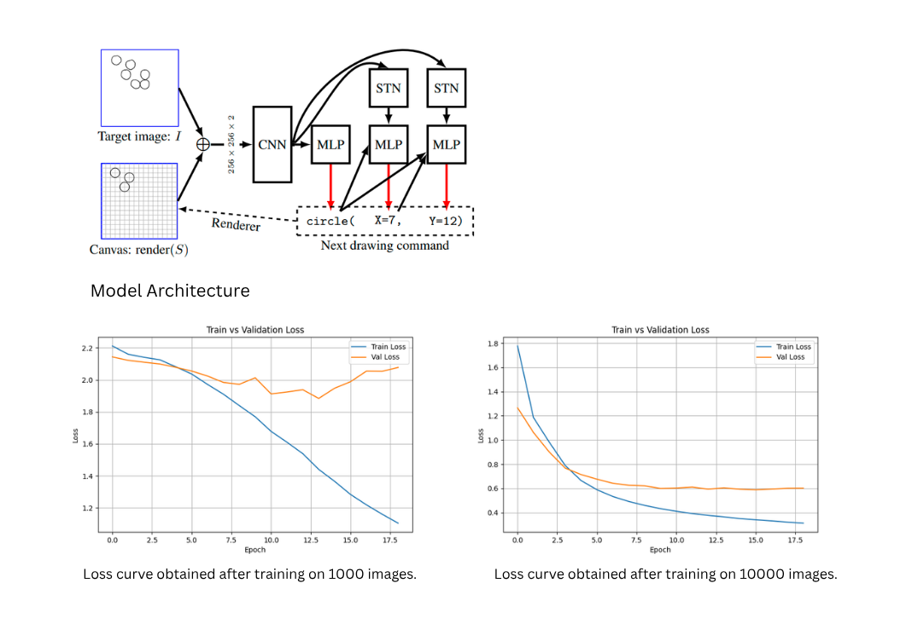

# ShapeReconstructor


ShapeReconstructor is an implementation inspired by the research paper:

**Learning to Infer Graphics Programs from Hand-Drawn Images**  
(2018, arXiv:1707.09627v5)

This project aims to reconstruct simple graphics programs from hand-drawn images by predicting drawing primitives and their parameters.

Given an input image containing geometric shapes, the model predicts a sequence of drawing commands such as:

```text
circle(x, y, r)
line(x1, y1, x2, y2)
rectangle(x1, y1, x2, y2)
```

The system learns to infer these commands autoregressively from rasterized sketches.

---

## Project Objective
The goal of this project is to replicate the core ideas presented in the paper:

- Convert hand-drawn images into executable graphics programs
- Infer primitive shapes and their parameters
- Use autoregressive decoding to reconstruct structured drawing commands

---

## Supported Shapes
Currently, the model supports:
- Circle
- Line
- Rectangle
- Stop token (sequence termination)

---

## Installation
Clone the repository:
```bash
git clone https://github.com/RaoGhulam/ShapeReconstructor.git
cd ShapeReconstructor
```

Create Virtual Environment:
```bash
python -m venv venv
source venv/bin/activate
```

Install Dependencies:
```bash
pip install -r requirements.txt
```

---

## Dataset Generation
Synthetic datasets can be generated using the provided script:

```bash
python create_dataset.py --size 100000
```

The script creates synthetic rasterized images paired with corresponding ground-truth drawing programs.

---

## Train

Train model from scratch:
```bash
python train.py --epochs 5
```
Resume training:
```bash
python train.py --epochs 5 --resume
```

---

## Model Architecture
The architecture follows the general structure proposed in the paper:

### 1. CNN Feature Extractor
**Module:** CNNFeatureExtractor

**Input:** target [1, 1, 256, 256], canvas [1, 1, 256, 256] (concatenated to [1, 2, 256, 256])

**Layer 1:** Parallel branches (all with padding="same", so output spatial size remains 256x256 before pooling)
- Branch 1: 20 kernels (size 8x8) → output [1, 20, 256, 256]
- Branch 2: 2 kernels (size 16x4) → output [1, 2, 256, 256]
- Branch 3: 2 kernels (size 4x16) → output [1, 2, 256, 256]
- Concatenation → [1, 24, 256, 256]

**Max-pooling layer:** kernel_size=8, stride=4 → reduces from 256x256 to 64x64 (output [1, 24, 64, 64])

**Layer 2:** 
- Conv2d: 10 kernels (size 8x8, no padding) → reduces from 64x64 to 57x57 → output [1, 10, 57, 57]
- ReLU
- MaxPool2d: kernel_size=4, stride=4 → reduces from 57x57 to 14x14 (since 57/4 = 14.25, floor to 14)

**Output:** [1, 10, 14, 14]

---

### 2. Command Type Predictor
**Module:** CommandTypePredictor

**Input:** feature map [1, 10, 14, 14] from CNN

**Layer 1:** Flatten
- Reshape [1, 10, 14, 14] → [1, 1960] (since 10 × 14 × 14 = 1960)

**Layer 2:** Linear (Fully Connected)
- 1960 input features → 4 output features (no activation, outputs logits)

**Output:** logits [1, 4] (raw scores for 4 shape classes)

---

### 3. Spatial Transformer
**Module:** SpatialTransformerNetwork

**Input:** feature map f [1, 10, 14, 14] from CNN, plus prev_onehots (concatenated one-hot encodings of previous tokens) with dimension = num_shapes (4) + prev_token_dim (MAX_PARAMS × GRID_SIZE) → total 4 + (MAX_PARAMS × GRID_SIZE)

**Layer 1:** Linear (Localization Network)
- Input: 4 + (MAX_PARAMS × GRID_SIZE) features → Output: 6 parameters (weights initialized to zero, bias initialized to [1,0,0,0,1,0] for identity transform)

**Layer 2:** Grid Generation
- Reshape 6 parameters to affine theta matrix [1, 2, 3]
- Generate sampling grid matching input feature size [1, 10, 14, 14]

**Layer 3:** Grid Sampling
- Apply affine transformation to feature map f → output f_prime with same spatial size [1, 10, 14, 14] (transformed via rotation, scaling, translation, or shear)

**Output:** transformed feature map f_prime [1, 10, 14, 14]

---

### 4. Parameter Token Prediction
**Module:** ParameterTokenPredictor

**Input:** 
- f_prime (transformed feature map) [1, 10, 14, 14] from STN → flattened to [1, 1960]
- prev_onehots (concatenated one-hot encodings) with dimension = num_shapes (4) + prev_token_dim (MAX_PARAMS × GRID_SIZE) → total 4 + (MAX_PARAMS × GRID_SIZE)

**Layer 1:** Concatenation
- Combine f_flat [1, 1960] and prev_onehots [1, 4 + (MAX_PARAMS × GRID_SIZE)] → input vector [1, 1964 + (MAX_PARAMS × GRID_SIZE)]

**Layer 2 (for line commands, hidden_size=32):** MLP with hidden layer
- Linear: 1964 + (MAX_PARAMS × GRID_SIZE) → 32
- ReLU
- Linear: 32 → grid_size (e.g., 16)

**Layer 2 (for other shapes, hidden_size=0):** Direct linear layer
- Linear: 1964 + (MAX_PARAMS × GRID_SIZE) → grid_size (16)

**Output:** logits [1, 16] (raw scores for 16 possible coordinate positions along one axis)

---

## Autoregressive Decoding
The model predicts commands sequentially.  
Generation process:  
- Predict shape type
- Predict shape parameters token-by-token
- Append command to canvas
- Repeat

Decoding stops when the model predicts the Stop token.

---

## Training Strategy
**Teacher Forcing**  
Teacher forcing is used during training.  
At each decoding step:
- Ground-truth previous tokens are fed into the next prediction stage

This stabilizes sequence learning and improves convergence.

---

## Experiments
We trained the model on:  
**Dataset Size: 1,000**  
Training logs: [console_log_1000.txt](./console_log_1000.txt)

**Dataset Size: 10,000**  
Training logs: [console_log_10000.txt](./console_log_10000.txt)

---

## Results

Due to compute constraints, we were unable to train on the full **100,000-image dataset** used in the original paper.
However:
- Both 1,000 and 10,000 image experiments show consistently decreasing training loss
- Validation loss also decreases steadily
- The implementation behaves as expected

These results strongly suggest that the implementation is functionally correct.  
While full-scale reproduction remains computationally expensive, we expect comparable performance to the original paper when trained on 100,000 samples.